

  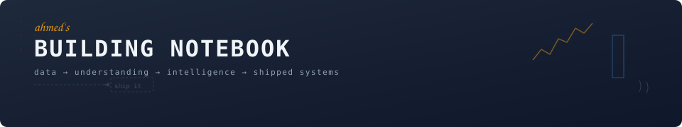

## Hey, I'm Ahmed 👋

AI & Data Engineer from Cairo.

I like taking work that feels annoyingly repetitive and turning it into a system that just runs — so humans can spend time on the parts a computer can't do yet.

  

  
  
  

  

---

## On my desk right now

🟨 teaching CS
🟦 wiring up AI automation workflows
🟩 exploring data-intelligence tooling
🟪 turning experiments into products

---

## Things I've built

The stuff I keep coming back to:

<table>
  <tr>
    <td align="center" width="33%">
      <a href="https://github.com/Arasoul/AI-Pharaoh">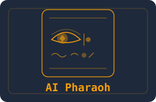</a> 
      <b><a href="https://github.com/Arasoul/AI-Pharaoh">AI Pharaoh</a></b> 
      Actually teaching a machine to read hieroglyphs.
    </td>
    <td align="center" width="33%">
      <a href="https://github.com/Arasoul/meridian-wings-platform">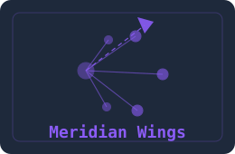</a> 
      <b><a href="https://github.com/Arasoul/meridian-wings-platform">Meridian Wings</a></b> 
      Optimizing a network when the future is uncertain.
    </td>
    <td align="center" width="33%">
      <a href="https://github.com/Arasoul/AutoEDA">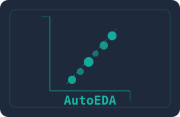</a> 
      <b><a href="https://github.com/Arasoul/AutoEDA">AutoEDA</a></b> 
      Give it a dataframe. It asks the annoying questions first.
    </td>
  </tr>
  <tr>
    <td align="center" width="33%">
      <a href="https://github.com/Arasoul/DataPrepToolkit">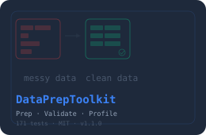</a> 
      <b><a href="https://github.com/Arasoul/DataPrepToolkit">DataPrepToolkit</a></b> 
      Messy data in. Usable data out.
    </td>
    <td align="center" width="33%">
      <a href="https://github.com/Arasoul/healthcare-ml-api">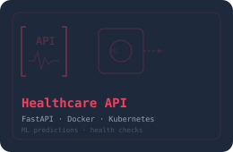</a> 
      <b><a href="https://github.com/Arasoul/healthcare-ml-api">Healthcare ML API</a></b> 
      Models wrapped in an API that actually deploys.
    </td>
    <td align="center" width="33%">
      <a href="https://github.com/Arasoul/movie-recommendation-vector-search">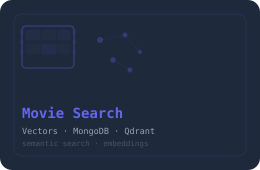</a> 
      <b><a href="https://github.com/Arasoul/movie-recommendation-vector-search">Movie Search</a></b> 
      Semantic movie search. Meaning instead of keywords.
    </td>
  </tr>
</table>

> 🗒️ **AutoBI lives on the portfolio rather than the public repo shelf.** It's one of my main data-intelligence projects — explore the full [case study →](https://ahmed-abdelrasoul-portfolio.vercel.app/projects/auto-bi)

---

## The data experiment

I got tired of rewriting the same data workflow for every project. So I started building the pieces I kept redoing:

  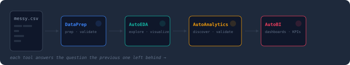

*Each tool came from the question the previous one left unanswered.*

- [DataPrepToolkit](https://github.com/Arasoul/DataPrepToolkit) — prep, validate, profile (171 tests, MIT)
- [AutoEDA](https://github.com/Arasoul/AutoEDA) — explore, visualize, report (265 tests, MIT)
- [AutoBI](https://ahmed-abdelrasoul-portfolio.vercel.app/projects/auto-bi) — dashboards that survive contact with real data

---

## Tools I keep reaching for

#### AI / Data

  
  
  
  
  
  
  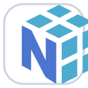

#### Engineering

  
  
  
  
  
  
  

#### Automation / Analytics

  
  
  
  · APIs

Build · Think · Train · Ship · Automate

---

## Code trails

A small snapshot of what accumulates when I spend too much time inside repositories.

  <picture>
    <source media="(prefers-color-scheme: dark)" srcset="./assets/stats/github-stats-dark.svg">
    <source media="(prefers-color-scheme: light)" srcset="./assets/stats/github-stats-light.svg">
    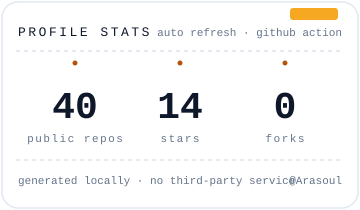
  </picture>
  &nbsp;
  <picture>
    <source media="(prefers-color-scheme: dark)" srcset="./assets/stats/languages-dark.svg">
    <source media="(prefers-color-scheme: light)" srcset="./assets/stats/languages-light.svg">
    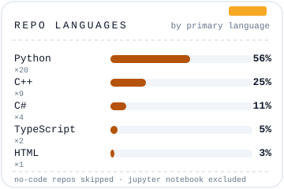
  </picture>

<em>Repo languages, not a skill ranking.</em>

The cards live in this repo and refresh daily via a GitHub Action — no third-party stats service. Jupyter Notebook is excluded from the language chart.

---

## Side quests

Not everything needs to become a product. Sometimes I build something just because the problem looks fun.

- 🎯 trained a face recognizer that runs live — [face-recognition-streamlit](https://github.com/Arasoul/face-recognition-streamlit)
- 📡 sniffed network packets and turned them into ML features — [Network-Packet-Analyzer](https://github.com/Arasoul/Network-Packet-Analyzer)
- 🔐 broke my own encrypted connection to understand MITM — [secure-network-communication](https://github.com/Arasoul/secure-network-communication)
- 🎮 built an ASCII platformer because... why not — [Console-Platformer-Quest](https://github.com/Arasoul/Console-Platformer-Quest)

---

## On my whiteboard

Things on my mind lately:

- → making AI agents actually useful in messy, real-world workflows
- → automation that survives the ugly edge cases
- → turning notebooks into products people can rely on
- → going from a dataframe to a decision people trust

---

## Say hi

If you're building something interesting, wrestling with messy data, or just want to talk AI systems — reach out.

[**Portfolio**](https://ahmed-abdelrasoul-portfolio.vercel.app/) · [**LinkedIn**](https://www.linkedin.com/in/ahmed-abdelrasoul-ai/) · [**Email**](mailto:ahmedmrasoul@gmail.com)

